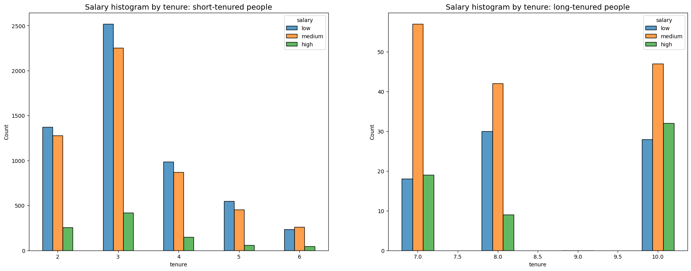
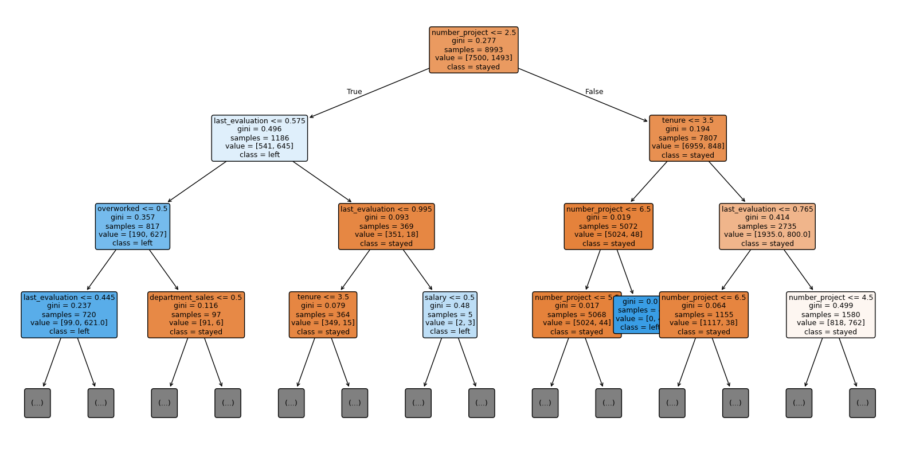
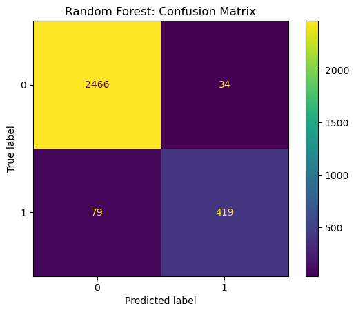

# Predicting Employee Attrition — Salifort Motors HR Capstone

Data-driven analysis and predictive modeling to identify why employees leave
Salifort Motors, and what the company can do about it.

**Author:** Zohra | BS Statistics, University of the Punjab (CSAS)

## Overview

The HR department at Salifort Motors wants to understand what drives
employee attrition and improve retention. This project explores the
employee dataset (15,000 rows, 10 features), builds and compares several
classification models, and translates the results into concrete
recommendations for stakeholders.

**Methods:** EDA, logistic regression, decision tree, and random forest
(with `GridSearchCV` hyperparameter tuning), evaluated on precision, recall,
F1, AUC, and accuracy.

**Key findings:**
1. A tuned random forest model predicts attrition with an AUC of ~96.6% and
   precision/recall in the low-to-mid 90s on the class of employees who
   left — a strong improvement over logistic regression's 26% recall on
   that class.
2. Feature importance and EDA both point to overwork as the central driver:
   employees on more projects, working longer average monthly hours, and
   without a promotion in the last several years are far more likely to
   leave.
3. A cluster of four-year-tenured employees shows unusually low
   satisfaction despite average performance, warranting its own
   investigation.

**Recommendations:**
- Cap the number of concurrent projects per employee
- Investigate why four-year-tenured employees are especially dissatisfied
- Reward or reduce excessive overtime
- Clarify workload and time-off expectations
- Hold company-wide discussions on work culture

## Data

Source: [HR Analytics and Job Prediction dataset, Kaggle](https://www.kaggle.com/datasets/mfaisalqureshi/hr-analytics-and-job-prediction?select=HR_comma_sep.csv).

Place `HR_comma_sep.csv` in the `data/` folder before running the notebook.
It is not included in this repository — download it from the source above.

## Project structure

```
hr-attrition-capstone/
├── hr_attrition_capstone.ipynb   # Full analysis
├── images/                       # Plots referenced in this README
├── data/                         # Place HR_comma_sep.csv here (gitignored)
├── requirements.txt
├── LICENSE
└── README.md
```

## Setup

```bash
git clone <this-repo-url>
cd hr-attrition-capstone
pip install -r requirements.txt
```

Then place `HR_comma_sep.csv` in `data/` and open
`hr_attrition_capstone.ipynb`.

## Results






